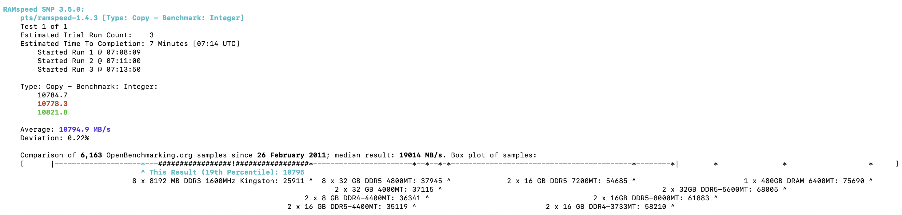

# CSIT5970 Assignment-1: EC2 Measurement (2 questions, 4 marks)

### Deadline: 11:59PM, Feb, 28, Friday

---

### Name: Li Yuanyuan
### Student Id: 21075541
### Email: ylisj@connect.ust.hk

---

## Question 1: Measure the EC2 CPU and Memory performance

1. (1 mark) Report the name of measurement tool used in your measurements (you are free to choose *any* open source measurement software as long as it can measure CPU and memory performance). Please describe your configuration of the measurement tool, and explain why you set such a value for each parameter. Explain what the values obtained from measurement results represent (e.g., the value of your measurement result can be the execution time for a scientific computing task, a score given by the measurement tools or something else).

    > I use **Phoronix Test Suite** in my measurements.
    >
    > configuration:
    >
    > **For CPU performance:**
    >
    > - phoronix-test-suite run pts/compress-7zip
    > - **Results：**
    >   - **MIPS** stands for *Million Instructions Per Second*, a measure of how many millions of instructions a processor can execute per second. It provides an indication of the system’s raw computational speed during the compression process.
    >   - The **Compression Rating** values are the results of compressing data using the 7-Zip algorithm. 
    >   - The **Decompression Rating** measures how many million instructions per second the system can process during the decompression of data, which is usually a different operation than compression.
    >
    > 
    >
    > **For Memory performance:**
    >
    > - phoronix-test-suite run pts/ramspeed
    > - **Options：** Here I choose '**1:** Copy' and '**1:** Integer' , to test the memory performance when copying Integers
    >   - **1:** Copy **2:** Scale **3:** Add **4:** Triad **5:** Average **6:** Test All Options
    >   - **1:** Integer **2:** Floating Point **3:** Test All Options
    > - **Results:**
    >   - **Average transfer rate** for the memory during the integer copy test. 
    >   - The unit “MB/s” refers to **megabytes per second**, and this represents the speed at which data can be copied in and out of memory.
    >
    > 
    >
    > 

2. (1 mark) Run your measurement tool on general purpose `t2.micro`, `t2.medium`, and `c5d.large` Linux instances, respectively, and find the performance differences among these instances. Launch all the instances in the **US East (N. Virginia)** region. Does the performance of EC2 instances increase commensurate with the increase of the number of vCPUs and memory resource?

    In order to answer this question, you need to complete the following table by filling out blanks with the measurement results corresponding to each instance type.

    | Size        | CPU performance | Memory performance |
    | ----------- | --------------- | ------------------ |
    | `t2.micro` | Compression Rating: 3663 MIPS; Decompression Rating: 3072 MIPS | 10794.9 MB/s |
    | `t2.medium`  | Compression Rating: 10115 MIPS ; Decompression Rating: 5937 MIPS | 19547.68 MB/s |
    | `c5d.large` | Compression Rating: 7333 MIPS; Decompression Rating: 4846 MIPS | 13168.50 MB/s |

    > Region: US East (N. Virginia). Use `Ubuntu Server 22.04 LTS (HVM)` as AMI.

EC2 instance performance generally improves with more vCPUs and memory, but not always in a straight line. For example, **t2.medium** with 2 vCPUs offers about 3 times better CPU performance than **t2.micro** with 1 vCPU, while **c5d.large**, also with 2 vCPUs, has lower CPU performance because it’s optimized for specific tasks. 

Memory performance increases more directly with more memory, as seen with **t2.medium** outperforming **t2.micro** in memory speed. However, specialized instances like **c5d.large** focus on compute power and may not prioritize memory as much. So, while adding resources boosts performance, the type of instance matters based on the workload.

## Question 2: Measure the EC2 Network performance

1. (1 mark) The metrics of network performance include **TCP bandwidth** and **round-trip time (RTT)**. Within the same region, what network performance is experienced between instances of the same type and different types? In order to answer this question, you need to complete the following table.

    | Type                      | TCP b/w (Mbps) | RTT (ms) |
    | ------------------------- | -------------- | -------- |
    | `t3.medium` - `t3.medium` | 4140           | 0.432    |
    | `m5.large` - `m5.large`   | 4940           | 0.197    |
    | `c5n.large` - `c5n.large` | 3330           | 0.097    |
    | `t3.medium` - `c5n.large` | 2250           | 0.797    |
    | `m5.large` - `c5n.large`  | 2740           | 0.633    |
    | `m5.large` - `t3.medium`  | 4530           | 0.199    |

    > Region: US East (N. Virginia). Use `Ubuntu Server 22.04 LTS (HVM)` as AMI. Note: Use private IP address when using iPerf within the same region. You'll need iPerf for measuring TCP bandwidth and Ping for measuring Round-Trip time.

When instances are of the same type, they show the best network performance, with the m5.large and c5n.large instances offering the highest bandwidth and lowest RTT.

When instances are of different types, the network performance decreases, especially in terms of TCP bandwidth and increases in RTT. 

2. (1 mark) What about the network performance for instances deployed in different regions? In order to answer this question, you need to complete the following table.

| Connection                | TCP b/w (Mbps) | RTT (ms) |
| ------------------------- | -------------- | -------- |
| N. Virginia - Oregon      | 32.60          | 61.484   |
| N. Virginia - N. Virginia | 4510           | 0.278    |
| Oregon - Oregon           | 4620           | 0.354    |

> Region: US East (N. Virginia), US West (Oregon). Use `Ubuntu Server 22.04 LTS (HVM)` as AMI. All instances are `c5.large`. Note: Use public IP address when using iPerf within the same region.

Same region provides excellent network performance with high bandwidth and very low RTT, while different regions significantly reduce performance, with much lower TCP bandwidth and much higher RTT, indicating the latency involved when data must travel over long distances.
